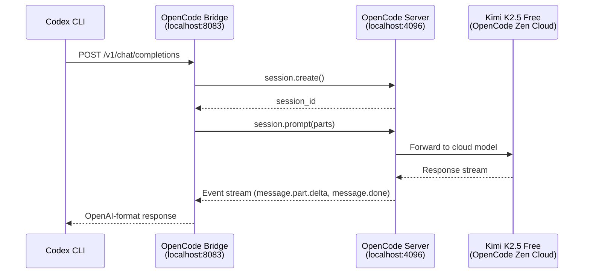
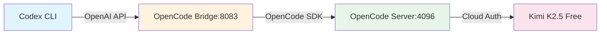

# OpenCode Bridge to Codex CLI Integration

## Architecture Diagram



## Component Flow



## Error Log

### Error 1: `opencode.global.health is not a function`
- **When**: Health check endpoint
- **Cause**: SDK doesn't export this function
- **Solution**: Simplified health check to just return bridge status

### Error 2: `Missing bearer or basic authentication in header` (401)
- **When**: Codex CLI calling bridge
- **Cause**: Codex CLI not using `opencode_bridge` provider
- **Solution**: Use `-c model_provider=opencode_bridge` flag

### Error 3: `eventStream is not async iterable`
- **When**: Streaming mode in bridge
- **Cause**: SDK returns `{ stream: AsyncIterable }`, not direct iterable
- **Solution**: Access via `eventHub.stream`

### Error 4: `Invalid input - No matching discriminator`
- **When**: Sending prompt to OpenCode
- **Cause**: `parts` array missing `type` field
- **Solution**: Change `{ text: "..." }` to `{ type: 'text', text: "..." }`

### Error 5: Empty content in response
- **When**: Non-streaming chat completions
- **Cause**: `opencode.session.prompt()` returns request echo, not response
- **Solution**: Must subscribe to event stream and wait for `message.done`

### Error 6: Response hangs indefinitely
- **When**: Waiting for event stream
- **Cause**: Event stream only shows heartbeats, no message events
- **Status**: 🔴 UNRESOLVED - Investigating

## Current Status

| Component | Status | Notes |
|-----------|--------|-------|
| OpenCode Server (4096) | ✅ Working | Web UI chat works fine |
| OpenCode Bridge (8083) | ⚠️ Partial | Receives requests, session creation works |
| Session Creation | ✅ Working | Sessions created successfully |
| Prompt Sending | ⚠️ Partial | SDK validates, but response not received |
| Event Stream | 🔴 Blocked | Only heartbeats, no message events |
| Codex CLI Integration | 🔴 Blocked | Depends on bridge working |

## Next Steps

1. **Investigate event stream**: Why are `message.part.delta` events not firing?
2. **Check OpenCode SDK version**: Maybe newer version has different API
3. **Alternative**: Use HTTP polling instead of event stream
4. **Fallback**: Direct HTTP calls to OpenCode REST API instead of SDK

## Test Commands

```bash
# Start OpenCode server
opencode serve --port 4096

# Start bridge (in separate terminal)
cd opencode-bridge && node opencode_bridge.js

# Test bridge health
curl http://localhost:8083/health

# Test models endpoint
curl http://localhost:8083/v1/models | jq '.models[].id'

# Test chat (this is what's failing)
curl -X POST http://localhost:8083/v1/chat/completions \
  -H "Content-Type: application/json" \
  -d '{"model": "opencode/kimi-k2.5-free", "messages": [{"role": "user", "content": "Hi"}], "stream": false}'

# Test with Codex exec
export DUMMY_KEY="any"
codex exec "Hello" -c model_provider=opencode_bridge --model opencode/kimi-k2.5-free
```
